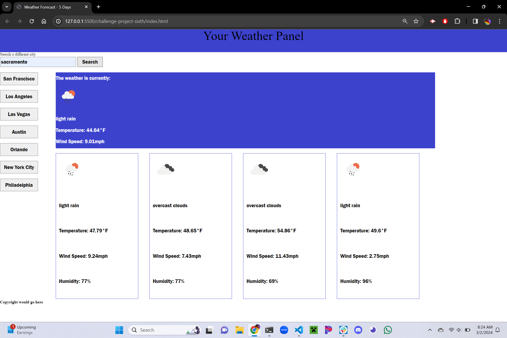

# 5 Day Weather Application

## Description

https://jessclark1234.github.io/weather-api-app/

This project was to show my knowledge on how to parse through information provided by OpenWeather API and any other API. My task was to build a 5 Day Weather Report for any city in the world. Simply type in a city name and you will be able to view the weather for the current day and 4 days after that. 

## Installation

There is no installation needed in order to use this application.

## Usage

This applcation can be used to look up a 5 day weather forecast for anywhere in the world. Simply type the name of the city you wish to see the weather of or click one of the major city buttons for easy access.

## Testing

Testing consisted of figuring out CSS layout and parsing through the data provided by the OpenWeather API to see what I needed to put on the page.

## Credits

A special thank you to my tutor, Andrew Hardemon, for helping me parse through the data provided by the API and figure out how to fix my CSS issues. 

## License
MIT License
Copyright (c) 2023 jessclark1234

Permission is hereby granted, free of charge, to any person obtaining a copy
of this software and associated documentation files (the "Software"), to deal
in the Software without restriction, including without limitation the rights
to use, copy, modify, merge, publish, distribute, sublicense, and/or sell
copies of the Software, and to permit persons to whom the Software is
furnished to do so, subject to the following conditions:

The above copyright notice and this permission notice shall be included in all
copies or substantial portions of the Software.

THE SOFTWARE IS PROVIDED "AS IS", WITHOUT WARRANTY OF ANY KIND, EXPRESS OR
IMPLIED, INCLUDING BUT NOT LIMITED TO THE WARRANTIES OF MERCHANTABILITY,
FITNESS FOR A PARTICULAR PURPOSE AND NONINFRINGEMENT. IN NO EVENT SHALL THE
AUTHORS OR COPYRIGHT HOLDERS BE LIABLE FOR ANY CLAIM, DAMAGES OR OTHER
LIABILITY, WHETHER IN AN ACTION OF CONTRACT, TORT OR OTHERWISE, ARISING FROM,
OUT OF OR IN CONNECTION WITH THE SOFTWARE OR THE USE OR OTHER DEALINGS IN THE
SOFTWARE.
